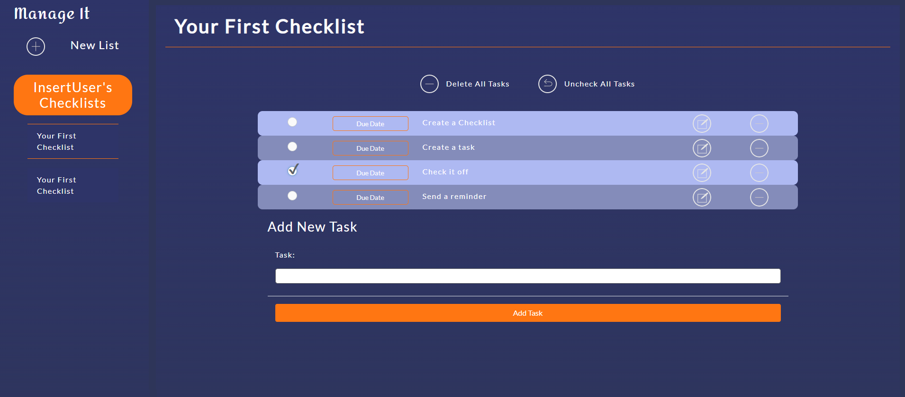

# Manage It

## Description

Manage mundane repetitve tasks quickly and easily. Send reminders via text to yourself or others. Manage it is a simple, barebones checklist application that lets you create checklists and edit it to your desires. Additionally, there is a functionality to send a text at a scheduled time for the task of your choosing.

## Deployment Link
https://cryptic-bastion-04157.herokuapp.com/

## Table of Contents
* [Installation](#installation)
* [Usage](#usage)
* [License](#license)
* [Questions](#questions)
## Installation
Simply click the deployed link at the top of this readme, make an account if you haven't already, and log in. 
## Usage
Make checklists and tasks with our (hopefully) intuitive UI. Schedule a reminder with the reminder button.

## License
This project is covered under the MIT license.
[Click here to see the terms of the license](https://choosealicense.com/licenses/mit/)
## Questions
Any questions or concerns?
Contact us on our githubs: 

[blazelim](https://github.com/blazelim/) 

[celinalou92](https://github.com/celinalou92/)

[Xavy-Romeo](https://github.com/Xavy-Romeo/)

Or email us at at:

blazebentleycolim@gmail.com

celinalouissaint@gmail.com

xavy.romeo.sse@gmail.com
